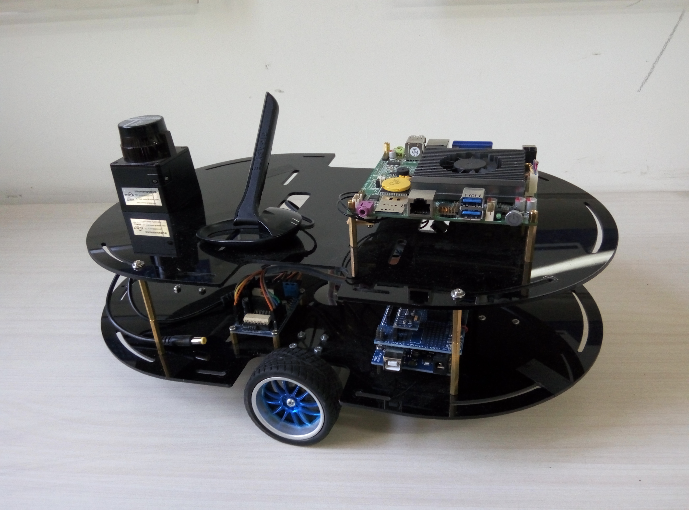
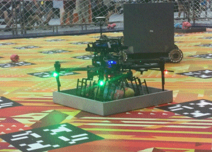
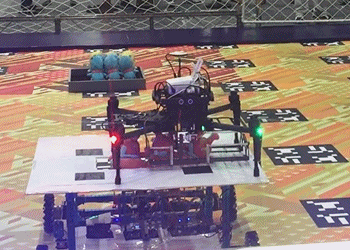
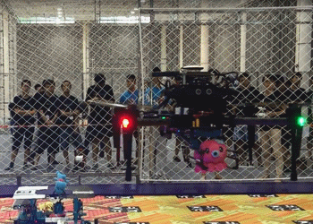
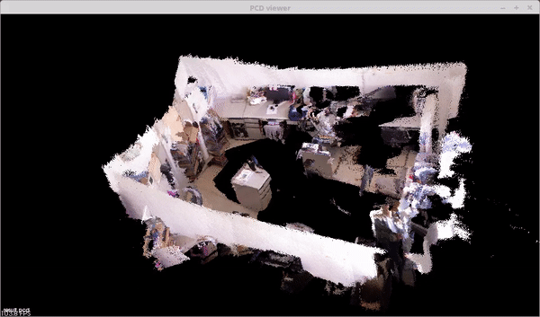
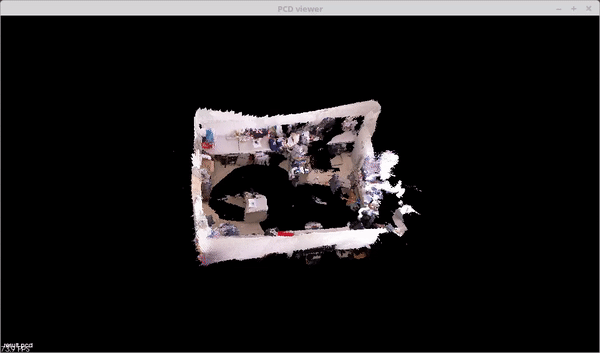
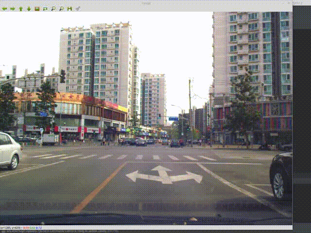
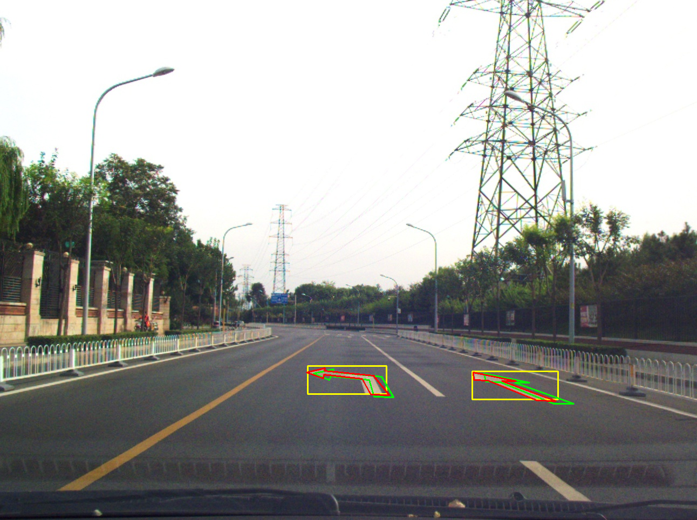
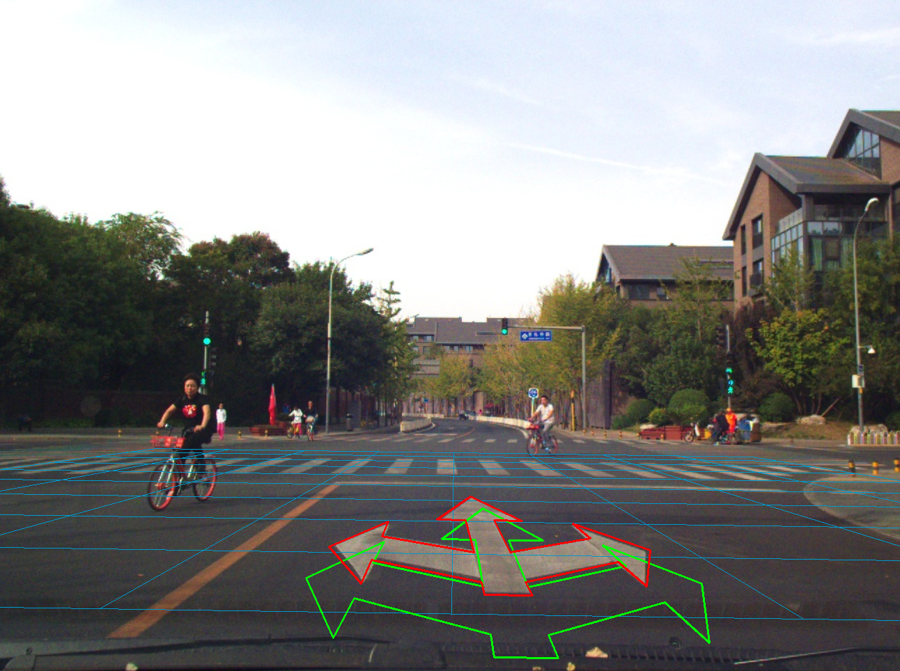
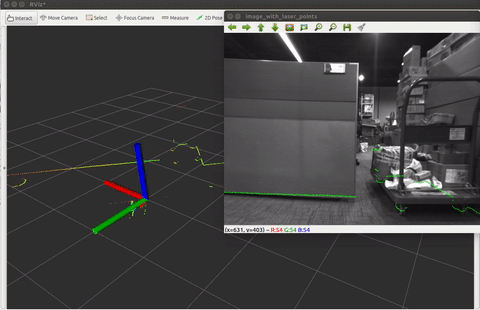

# Projects Summary

### **Author:** Xinliang Zhong [xinliangzhong@foxmail.com](http://www.hao123.com/mail)

*	[0.Research on Real-time Location and Construction of Indoor Mobile Robots](#0)
*	[1. DJI Robomasters Summer Camp.](#1)
*	[2. Reconstruction of the scene based on RGBD-Camera.](#2)
*	[3. An offline tool for pose-graph-optimization.](#3)
*	[4. Auto Label tool for Autonomous Car.](#4)
*	[5. Msckf-Mono.](#5)
*	[6. Camera-Lidar-Calibration](#6)

## 0.Research on Real-time Location and Construction of Indoor Mobile Robots.
This projects aims to design a way to locate indoors autonomous mobile robot, the robot is equipped by the relevant sensor itself can be in a completely unknown environment situation accurately draw the map of the surrounding environment, and in this to achieve accurate positioning itself on the map basis.

| Robot | Mapping process |
|--------|--------|
|  |  |

## 1.DJI [Robomasters](http://bbs.robomasters.com/portal.php) Summer Camp.
This projects aims to design an autonomous MAV and a mobile robot that can grab the doll and place it in the bucket corresponding to the doll pattern. Below are some gifs. You can find the rules here and the final results in this [**video**]().

|  |  |
|--------|--------|
|  |  |

The video of this competition can be found [**here**](http://bbs.robomasters.com/thread-4057-1-1.html)

## 2.Reconstruction of the scene based on RGBD-Camera.

It is a simple SLAM sysstem based on RGBD-cameras. Below are the pointcloud of the office.

##### The experiment of Loop Closure.

| wirhout loop closure | with loop closure |
|--------|--------|
|  |  |

## 3.An offline [tool](https://github.com/TurtleZhong/PoseGraph-Ceres) for pose-graph-optimization.

It is an offline tool for **Pose-Graph**. You will get an trajectory file (usually with x,y,z) after you have run the **SLAM** and **VO** algorithm. If the datasets contains a loop, This tool can optimize the pose and eliminate the cumulative error.

##### **Code is available** [**here**](https://github.com/TurtleZhong/PoseGraph-Ceres)!

## 4.Auto Label [tool](https://github.com/TurtleZhong/AutoLabel-tool) for Autonomous Car.

The projects contains 2 main targets. One for **re-projection** the road sign and some other infomation to the 2d image to verify the SLAM algorithm. The other one is a tool used for **automatic label** the road sign. Since the project2 is more important, We take porject 2 first place.

##### **Code is available** [**here**](https://github.com/TurtleZhong/AutoLabel-tool)!

|  |  |
|--------|--------|
|  |  |

## 5. Msckf-Mono.

This project is under constuction and based on this paper:
[A Multi-State Constraint Kalman Filter for Vision-aided Inertial Navigation](./docs)
The **[MSCKF_mono](https://github.com/TurtleZhong/msckf_mono)** package is a mono version of MSCKF. The software takes in synchronized mono images and IMU messages and generates real-time 6DOF pose estimation of the IMU frame.

The tracking results:

## 6. Camera-Lidar-Calibration.

##### **Code is available** [**here**](https://github.com/TurtleZhong/camera_lidar_calibration)!

The package is used to calibrate a 2D LiDAR or laser range finder(LRF) with a monocular camera. Specficially, Hokuyo UTM-30LX have been suscessfully calibrated against a mono camera.

The calibration results:

|  |  |
|--------|--------|

